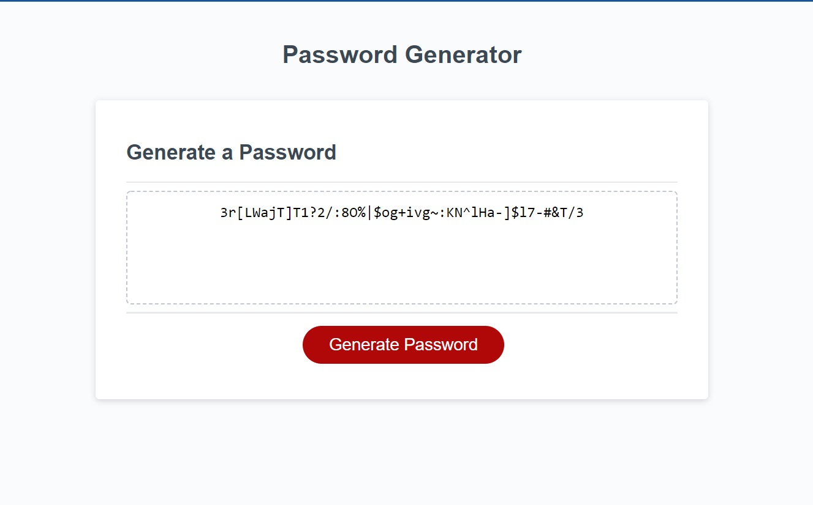

# Week 4 Project "random-password-generator"

* Live URL: https://naeemishere.github.io/password-generator/
* GitHub URL:  https://github.com/naeemishere/password-generator

## Contents: 
* [Info](#info)
* [Technologies](#technologies)
* [Features](#features)
* [ScreenShot](#screenShot)
* [Contact](#contact)

## Information:
* This is a random password generator webpage.
* This webpage provides options random password generator with different characters to choose from.

## Technologies:
* HTML
* CSS
* JavaScript

## Features:
* This page allows you to create password with characters rang of between 12 to 128 characters.
* This page gives you an option to create password based on all the characters or any charchets (at least one catogary of selection required) such as (UpperCase, * LowerCase, Numeric, Special characters.).

## ScreenShot

## Contact:
Created By [_@naeemishere_](https://github.com/naeemishere)